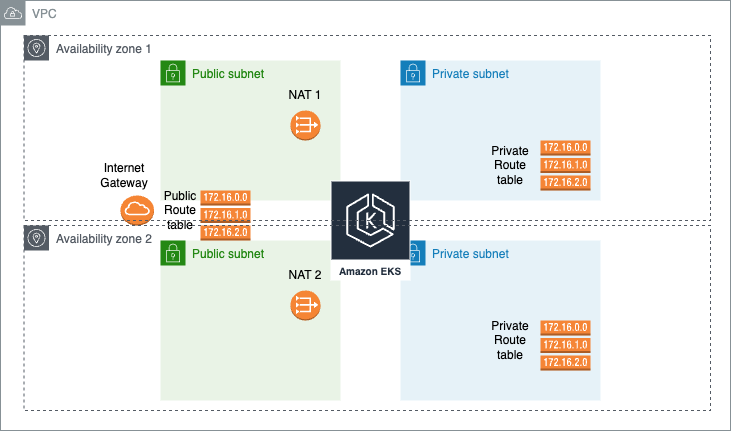

# kubernetes-labs
Pipelines and IaC for easily experimenting with kubernetes on multi-cloud

Problem statement: Its hard to experimenting with kubernetes on cloud because we need some building blocks
Solution: We can standardized the building blocks and Github Workflows in `main` branch, hence we can open new branch for experimentation and run workflows from there

Features supported:
- Standardized building blocks for EKS, including
	- VPC
	- Subnets
	- Internet Gateway
	- NAT Gateway
	- Routing Tables
	- EKS Cluster and Workers

	
- Terraform Plan, Apply CI/CD with OICD

Next steps:
- Add Terraform Destroy pipeline
- Protect Action to be run on permitted party
- Add how to readme
- Enable running with .env variable
- Add AKS (Azure) and GKE (Google)